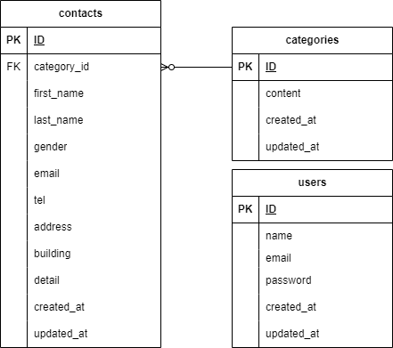

# お問い合わせフォーム

## 環境構築

### Docker ビルド

1. git clone git@github.com:takuichi01/contact-form-test.git
2. docker-compose up -d --build

### Laravel 環境構築

1. docker-compose exec php bash
2. composer install
3. .env.example ファイルから.env を作成し、環境変数を変更
   - DB_HOST=mysql
   - DB_DATABASE=laravel_db
   - DB_USERNAME=laravel_user
   - DB_PASSWORD=laravel_pass
4. php artisan key:generate
5. php artisan migrate --seed

## 使用技術

- PHP:7.4.9
- Laravel:8.83.8
- MySQL:8.0.26

## ER 図

## URL

- 開発環境：http://localhost/
  - 問い合わせ画面：http://localhost/
  - 確認画面：http://localhost/confirm
  - 問い合わせ送信後画面：http://localhost/thanks
  - 管理者ログイン画面：http://localhost/login
  - 管理者登録画面：http://localhost/register
  - 管理者画面：http://localhost/admin
- phpMyAdmin：http://localhost:8080/
